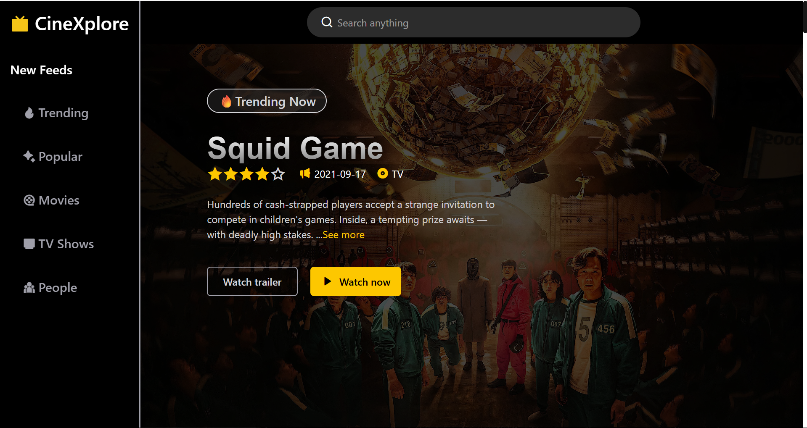
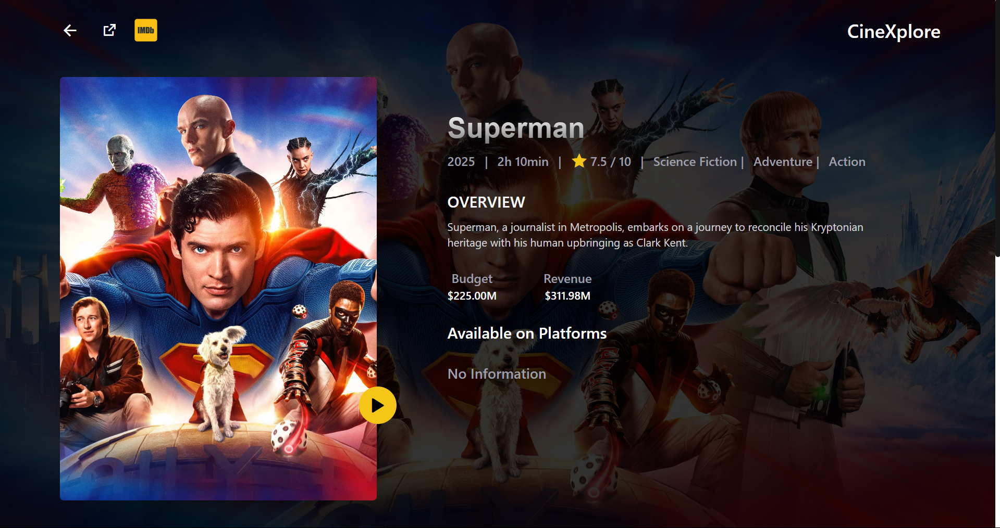
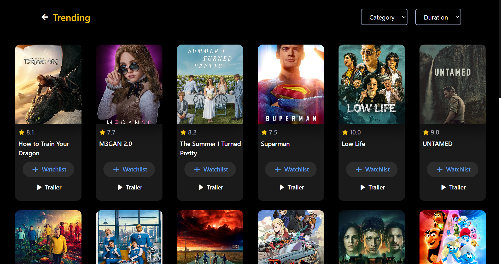
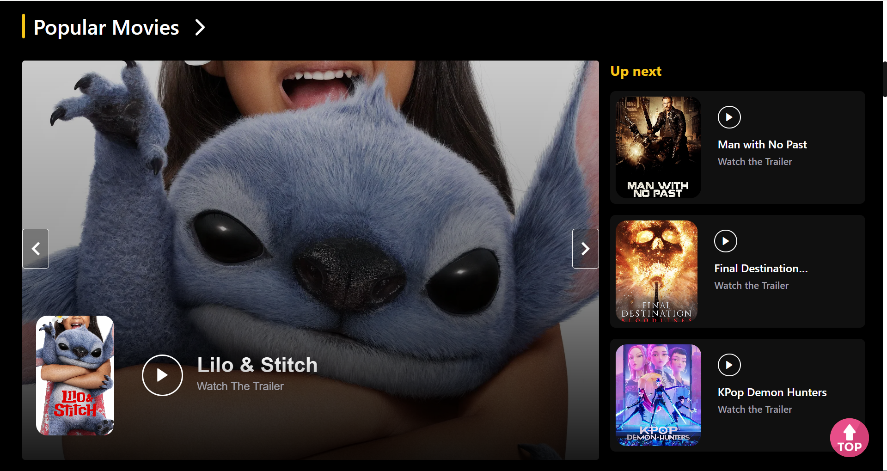
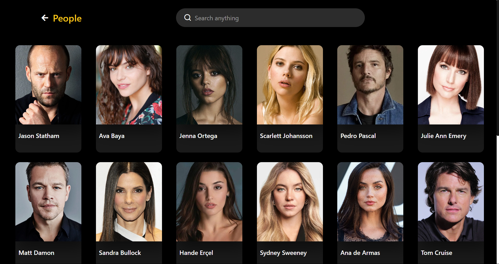
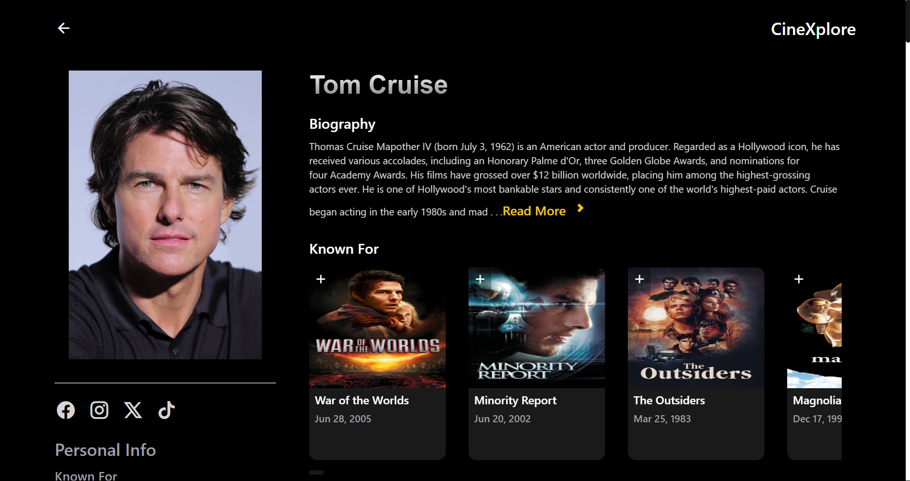
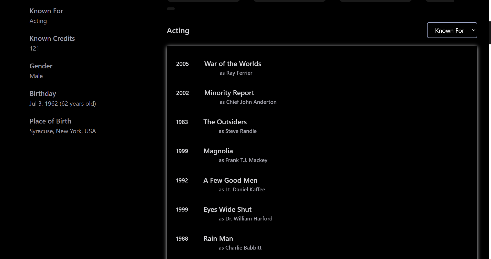

# 🎬 CineXplore

#### NOTE: If using **JIO** network to open this website please try another network to open it because API is blocked by **JIO**.

**Cinexplore** is a sleek and modern frontend web application that allows users to explore movies, TV shows, and people in the entertainment industry. Built entirely with **React** and **Tailwind CSS**, this project leverages **The Movie Database (TMDb) API** to provide rich, real-time content. Users can search, discover, and view where titles are available to stream (OTT platforms), along with detailed information.

---

## 🚀 Features

- 🔍 **Search Functionality**  
  Search for movies, TV shows, or people across TMDb’s vast database.

- 🎥 **Movie & TV Show Discovery**  
  Browse trending and popular titles, along with detailed metadata.

- 👤 **People Profiles**  
  View actor/director biographies, filmography, and related media.

- 📺 **OTT Platform Availability**  
  See where a movie or show is available for streaming (Netflix, Prime Video, etc.)

- 📄 **Detailed Information Pages**  
  Navigate to comprehensive pages for movies, TV shows, or people with cast, crew, ratings, release dates, and more.

- 📱 **Responsive UI**  
  Fully responsive design using Tailwind CSS — works beautifully on all devices.

---

## 🛠️ Tech Stack

- **Frontend:** React
- **Styling:** Tailwind CSS
- **API:** [TMDb (The Movie Database)](https://www.themoviedb.org/documentation/api)

---

## 🌐 Live Demo

> ** 👉 [cinexplore-movie.vercel.app](https://cinexplore-movie.vercel.app/)**

---

## 📸 Screenshots

### 🎬 Home Page

### 📄 Movie Details page

### 📄 Trending page

### 📄 Popular Page

### 📄 People Page

### 📄 People Details Page 1

### 📄 People Details Page 2

---
